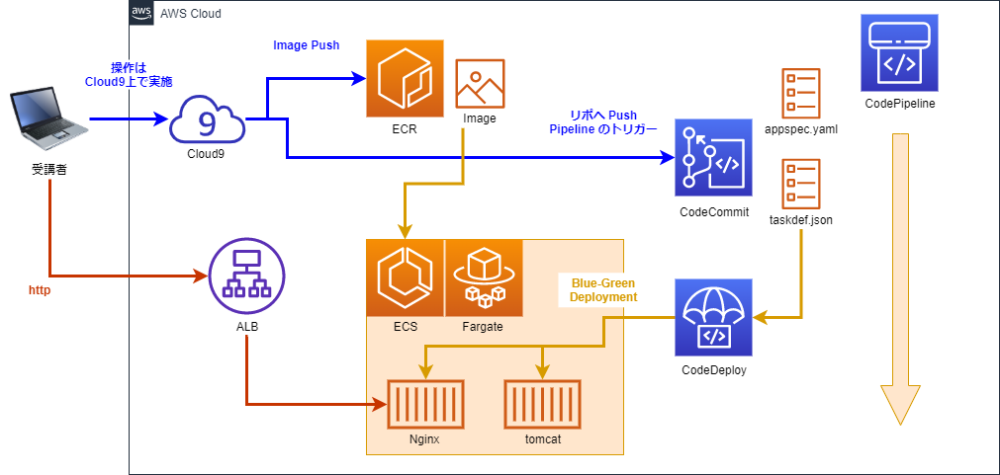

# getting-start-ecs-blue-green-deploy

社内で「はじめての Docker コンテナからの Blue-Green デプロイ勉強会」を開催しました。  
勉強会で使用したテキストを公開します。  

以下の環境は使い捨てとして考えてください。  
あくまで勉強用です。本番環境で同じ設定を使用しないでください。  

## AWS アカウント
演習用の AWS アカウントを用意します。  
AdministratorAccess 権限を持った IAM ユーザーを用意します。  

## VPC
演習用の VPC を作成します。  
CIDR は任意のもので大丈夫です。  

## パブリックサブネット
Internet Gateway への経路を持ったサブネットを2つ以上用意します。  

## セキュリティグループ
演習用セキュリティグループを作成します。  
送信元は、VPC CIDR と当該セキュリティグループを指定し、全ての通信を許可します。  
(演習用です)  

## AWS リソース図
この演習では以下のリソースを作成します。  

----

[Step1](step1/README.md)
