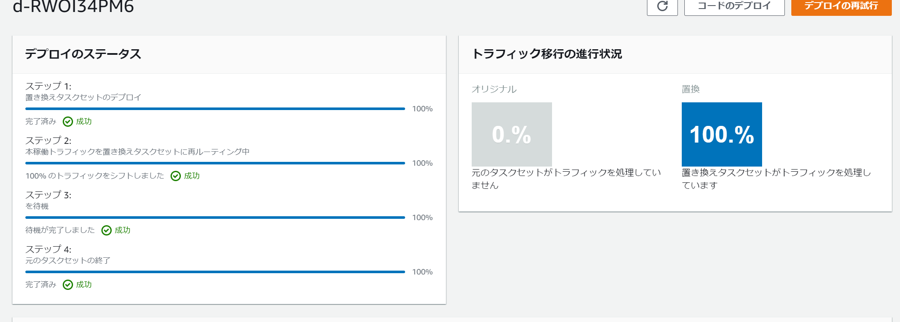

# Step 5

## CodeDeploy
CodeDeploy で Blue/Green デプロイを行うための設定を行います。  
作成済み ALB/Target Group を指定します。  
(account_id  はご自身のものへ変更)  


```
LBNAME=my-load-balancer
TG01NAME=${LBNAME}-target01
TG02NAME=${LBNAME}-target02

ALBARN=`aws elbv2 describe-target-groups --names ${TG01NAME} | jq -r .TargetGroups[].LoadBalancerArns[]`
LSNARN=`aws elbv2 describe-listeners --load-balancer-arn ${ALBARN} | jq -r .Listeners[].ListenerArn`


aws deploy create-application --application-name bluegreen-cluster --compute-platform ECS

aws deploy create-deployment-group  \
  --application-name bluegreen-cluster \
  --deployment-group-name bluegreen-cluster-group \
  --service-role-arn arn:aws:iam::<account-id>:role/ecsCodeDeployRole \
  --load-balancer-info "targetGroupPairInfoList=[{targetGroups=[{name=${TG01NAME}},{name=${TG02NAME}}],prodTrafficRoute={listenerArns=[${LSNARN}]}}]" \
  --ecs-services serviceName=bluegreen-service,clusterName=bluegreen-cluster \
  --blue-green-deployment-configuration "terminateBlueInstancesOnDeploymentSuccess={action=TERMINATE,terminationWaitTimeInMinutes=5},deploymentReadyOption={actionOnTimeout=CONTINUE_DEPLOYMENT,waitTimeInMinutes=0}" \
  --auto-rollback-configuration enabled=true,events=DEPLOYMENT_FAILURE \
  --deployment-style deploymentType=BLUE_GREEN,deploymentOption=WITH_TRAFFIC_CONTROL
```


## CodeCommit
Blue-Green デプロイのトリガーとなるリポジトリを作成します。  
GitHub がメジャーでパワフルですが、今回は演習なので CodeCommit を使います。  

### git インストール
Cloud9 環境で git を最新化します。  

```
sudo yum -y install git
```

### リポジトリ作成
リポジトリを作成します。  
your-repo は任意の文字列に置き換えてください。  

```
aws codecommit create-repository --repository-name your-repo
```

## S3バケット作成
CodePipeline 用のバケットを作成します。  
(account_id  はご自身のものへ変更)  

```
aws s3api create-bucket --bucket codepipeline-ap-northeast-1-<account_id>
```

## CodePipeline
CodeCommit への push をトリガーに ECS デプロイを自動化するパイプラインを作成します。  

[pipeline.json](pipeline.json) を作成します。  
(aws_account_id, your-repo はご自身ものへ変更)  

ファイルを作成したら以下のコマンドでパイプラインを作成します。  
```
aws codepipeline create-pipeline --cli-input-json file://pipeline.json
```

### マネジメントコンソールで確認
<a href="https://ap-northeast-1.console.aws.amazon.com/codesuite/codepipeline/start?region=ap-northeast-1" target="_blank">CodePipeline</a>  

パイプラインが作成されます。  
この時点では失敗しますが気にしないでください。  


## デプロイの開始
先ほど作成したリポジトリに appspec.yaml と taskdef.json を作成します。  
中身は ECS サービスの設定とタスク定義ファイルです。  

### git clone
リポジトリを Cloud9 環境にクローンします。  
your-repo は任意の文字列に置き換えてください。  

```
git clone https://git-codecommit.ap-northeast-1.amazonaws.com/v1/repos/your-repo
cd your-repo
```

### appspec.yaml
[appspec.yaml](appspec.yaml) ファイルを作成します。  
ファイル内のパプリックサブネット1、パプリックサブネット2、セキュリティグループはご自身の環境に合わせてください。  

### taskdef.json
「タスク定義」の手順で作成した bluegreen-task.json をコピーして taskdef.json にリネームします。  

```
cp ../step4/bluegreen-task.json taskdef.json
```


### git push
2つのファイル作成が終わったら CodeCommit リポジトリへプッシュします。  

```
git add -A
git commit -m "Added task definition files"
git push 
```

### デプロイの確認(パイプライン)
マネジメントコンソールから確認してみます。  

まずはパイプライン。  
<a href="https://ap-northeast-1.console.aws.amazon.com/codesuite/codepipeline/start?region=ap-northeast-1" target="_blank">CodePipeline</a>  

成功していれば以下の例のように緑色の文字で「成功しました」と出力されるはずです。  


### デプロイの確認(デプロイ)
続いてデプロイの確認です。  
CodePipeline からリンクで飛ぶ、もしくは、CodeDeploy 画面を直接開きます。  
<a href="https://ap-northeast-1.console.aws.amazon.com/codesuite/codedeploy/start?region=ap-northeast-1" target="_blank">CodeDeploy</a>  

デプロイのステータスが順番に進んでいる様子が確認できます。(下の例は全て終わっていますが・・)   
ステップの処理は大雑把に言うと以下です。  

1. GREEN 作成
2. BLUE から GREEN へトラフィック切り替え
3. 一定時間待機
4. BLUE シャットダウン


